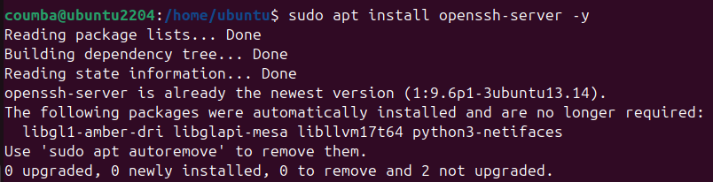
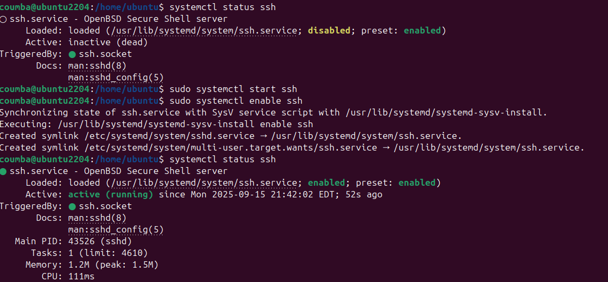
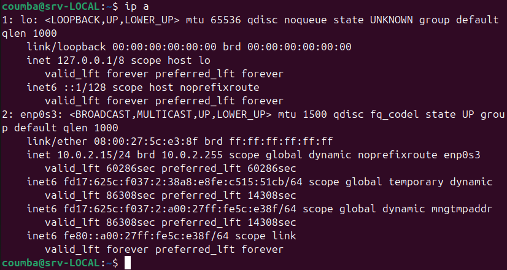
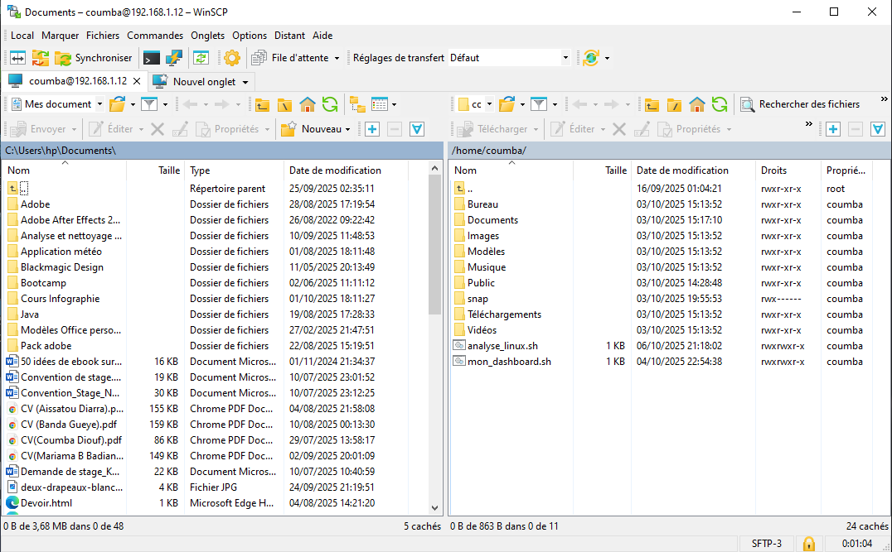
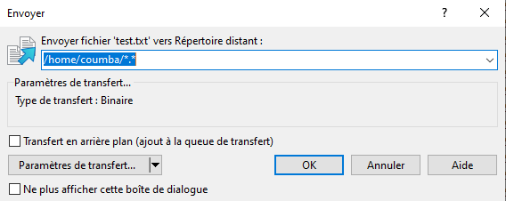
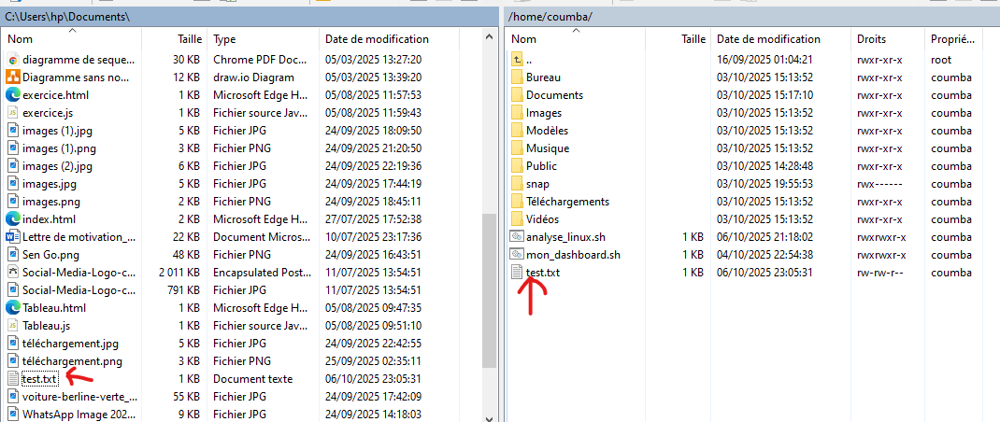
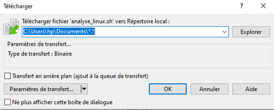
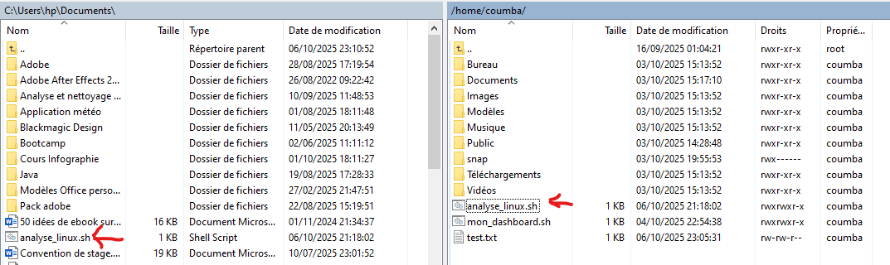

# Projet 5 - Tutoriel SSH + WinSCP
## Introduction

L’objectif de ce projet est de mettre en place une communication sécurisée entre une machine virtuelle Ubuntu et un poste Windows en utilisant le protocole SSH et l’outil WinSCP.
Cette configuration permet de se connecter à distance à la machine Ubuntu et de transférer des fichiers entre les deux systèmes sans support physique (clé USB, disque dur externe). Le projet vise également à se familiariser avec l’utilisation d’un serveur SSH, la configuration réseau de VirtualBox ainsi que la gestion des transferts de fichiers via une interface graphique.

##  🛠 Étape 1 : Installation d'OpenSSH Server sur Ubuntu

La première étape a consisté à installer et activer le serveur OpenSSH sur Ubuntu.  
Les commandes utilisées ont été : 

  

  **sudo apt install openssh-server -y** pour installer le paquet

   
  

 
  

  
  Puis **systemctl status ssh** pour vérifier que le service était bien actif. 
  Après vérification on a constaté que le service n’était pas activé, il a donc fallu démarrer et activer SSH à l’aide des commandes
suivantes :

**sudo systemctl start ssh**

**sudo systemctl enable ssh**

L’adresse IP de la machine virtuelle a ensuite été identifiée avec **ip a**.  
Au départ, la configuration réseau était en mode NAT (10.0.2.x), ce qui ne permettait pas une connexion directe depuis Windows.  
Pour résoudre ce problème, l’adaptateur réseau a été configuré en mode « Pont », ce qui a permis à Ubuntu et Windows d’être sur le même réseau local avec une adresse du type 192.168.x.x. 

## 🖥 Étape 2 : Installation et configuration de WinSCP sur Windows

La deuxième étape a été réalisée sur Windows avec l’installation de **WinSCP**.  
Après installation, la configuration a été faite avec les paramètres suivants : 
   - Protocole : **SFTP**  
   - Adresse IP : *adresse IP de la machine Ubuntu*  
   - Nom d’utilisateur et mot de passe Ubuntu  
   - Port : **22** (par défaut)

Une fois la connexion établie, l’interface de WinSCP a permis de visualiser le système de fichiers des deux machines.  

## 🔄 Étape 3 : Transfert de fichiers bidirectionnel

- **Test 1** : transfert d’un fichier créé sous Windows vers Ubuntu.

- **Test 2** : transfert d’un fichier créé sous Ubuntu vers Windows. 

Ces échanges valident la bonne communication entre les deux systèmes.

## Conclusion

Ce projet a permis de mettre en place un environnement de travail où Windows et Ubuntu peuvent communiquer de manière sécurisée grâce à SSH. L’installation et la configuration de OpenSSH sur Ubuntu ainsi que l’utilisation de WinSCP sur Windows ont facilité la gestion et le transfert des fichiers.
L’expérience a également mis en évidence l’importance de la configuration réseau dans VirtualBox, notamment le passage en mode pont pour permettre une connexion directe entre les deux machines.

